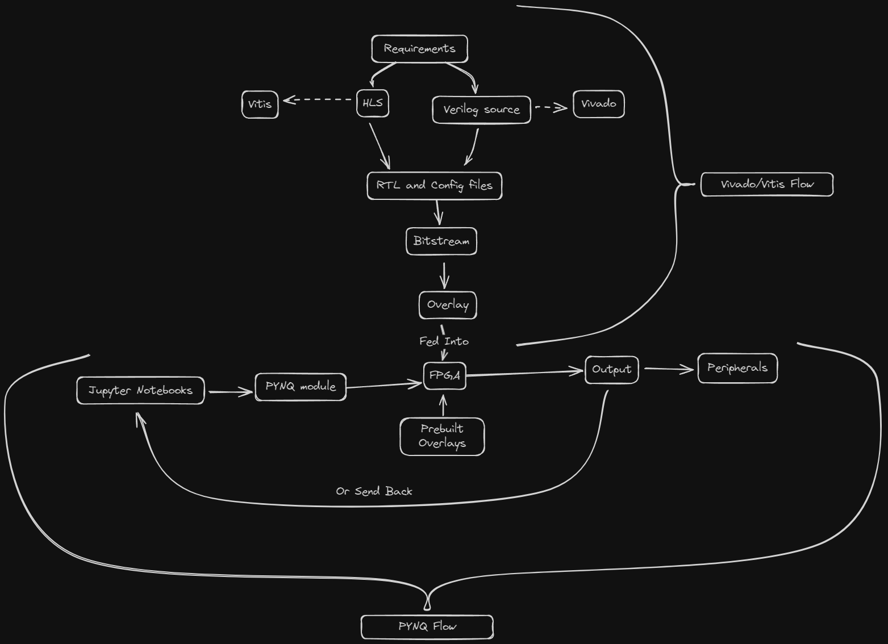

# The Boards
## Kria KV260 

The Kria KV260 Vision AI Starter Kit is a development board designed for accelerating image analysis and recognition tasks using machine learning. It features the Kria K26 system-on-module (SoM) which includes a quad-core Arm Cortex-A53 CPU, 4 GB of DDR4 memory, and a Xilinx FPGA for hardware acceleration.

### Specifications
- Kria K26 SoM with quad-core Arm Cortex-A53 CPU and Xilinx Zynq Ultrascale + MPSoC FPGA
- 4 GB DDR4 memory
- 1 Gb Ethernet
- USB 3.0 and USB 2.0 ports
- HDMI and DisplayPort outputs
- 3 MIPI camera interfaces supporting up to 8 cameras total
- Built-in image signal processor (ISP)
- Dimensions: 119 mm x 140 mm x 36 mm
### Applications
The KV260 is well-suited for a variety of machine vision applications including:
- Face recognition
- Automated quality inspection (e.g. PCB defect detection)
- Vehicle tracking
- Object identification
- Smart city applications like traffic cameras
- Industrial robotics and automation
- Hardware acceleration for deep learning inference
- Supports popular machine learning frameworks like TensorFlow Lite and PyTorch

## Kria KR260
The KR260 is a variant of the KV260 optimized for robotics applications
### Specifications
- Kria K26 SoM with quad-core Arm Cortex-A53 CPU and Xilinx Zynq Ultrascale + MPSoC FPGA
- 4 RJ45 Gigabit Ethernet ports for real-time networking
- 1 SFP+ 10 Gigabit Ethernet port for high-speed vision data
- 4 USB 3.0 ports for connecting cameras
- SLVS-EC camera interface
- Raspberry Pi and PMOD expansion headers
### Applications
Designed to work with the Robot Operating System (ROS)
	- Multi-camera machine vision
	- Real-time industrial communication
	- Robotics control and automation

## Comparison to Other Boards

| Boards                        | KV260                                                      | KR260                                                                                        | PYNQ-Z2                                            | ZCU104                                                         |
| ----------------------------- | ---------------------------------------------------------- | -------------------------------------------------------------------------------------------- | -------------------------------------------------- | -------------------------------------------------------------- |
| **Built-in Camera interface** | 3 MIPI camera interfaces, USB 3.0 ports                    | SLVS-EC camera interface, USB 3.0 ports                                                      | USB 3.0 (PS Only pipeline)                         | USB 3.0 (PS Only pipeline)                                     |
| **Networking**                | 1 Gigabit Ethernet port                                    | 4 RJ45 Gigabit Ethernet ports and 1 SFP+ 10 Gigabit Ethernet port for high-speed vision data | 1 Gigabit Ethernet and wireless connectivity       | high-speed 10GbE interface and USB-based Ethernet connectivity |
| **Video Output**              | Both HDMI and DisplayPort outputs                          | 1 DisplayPort 1.2a output                                                                    | HDMI-In block, a HDMI-Out block, and a Video DMA   | Support full 4K video output                                   |
| **Expansion Headers**         | Raspberry Pi, Pmod high-speed serial and memory interfaces | 4 Pmod connectors and a Raspberry Pi HAT header for expansion                                | Arduino, Pmod, and Raspberry Pi compatible headers | high-speed FMC, Pmod, and DDR4 SODIMM connectors               |
| **Target Applications**       | Vision Applications                                        | Robotics applications with multiple data sources                                             | Prototyping and proof-of-concept development       | High speed networking application like data processing and 5g  |

<b>
In summary, the KR260 has more networking ports, camera interfaces, and expansion options tailored for robotics, while the KV260 has a simpler design focused on vision AI with more video output options. The choice depends on the specific requirements of the application.</b>

# Development Flow

# Links
- [SOM Landing Page](https://xilinx.github.io/kria-apps-docs/home/build/html/index.html)
- [Tool Flow Overview](https://xilinx.github.io/kria-apps-docs/kv260/2022.1/build/html/docs/building_the_design.html)
#### [Kria KV260](<The KV260.md>)
- [Kria KV260 Vision AI Starter Kit](https://www.amd.com/en/products/system-on-modules/kria/k26/kv260-vision-starter-kit.html)
- [Kria KV260 Vision AI review](https://community.element14.com/technologies/fpga-group/b/blog/posts/kria-kv260-vision-ai-review)
- [AMD-Xilinx Kria KV260 Starter Kit: Exploring Machine Vision AI](https://hothardware.com/reviews/xilinx-kria-kv260-vision-ai-starter-kit-review)
#### [Kria KR260](<The KR260.md>)
- [Accelerate Your Robotics Design with the Kria KR260 Robotics Starter Kit](https://www.hackster.io/news/accelerate-your-robotics-design-with-the-kria-kr260-robotics-starter-kit-89191a42080d)
- [Kria KR260 Robotics Starter Kit](https://www.amd.com/en/products/system-on-modules/kria/k26/kr260-robotics-starter-kit.html)
