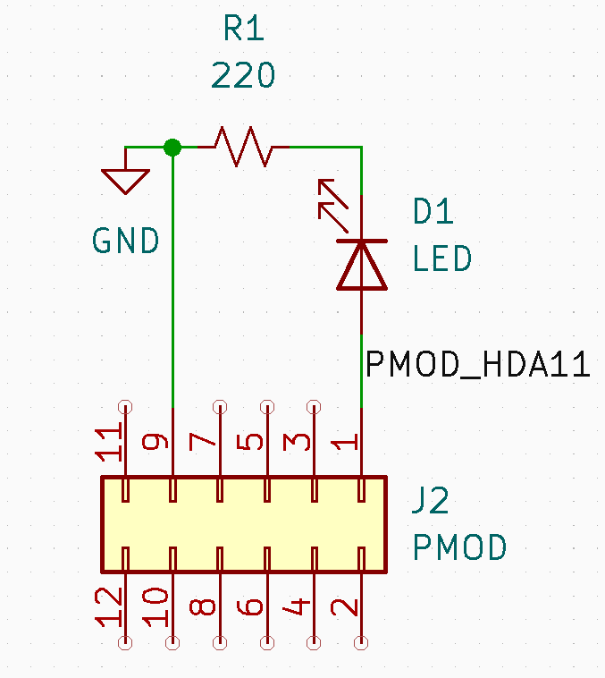

# Table Of Content
1. [Booting Up Linux](#booting-up-linux)
2. [Projects](#projects)
	- [LED Blinking](#led-blinking-project)
	- [FIR Filter](#fir-filter)
	- [Smart Cam](#smartcam-*)
	- [NLP & SmartVision](#nlp-&-smartvision-*)
3. [Advanced Projects](#advanced-projects)
	- [YOLO](#yolo-project)
	- [Pose Detection](#pose-detection)
	- [Eye state Detection](#eye-state-detection)
# Booting Up Linux
Follow this docs to boot Ubuntu into your boards :- [Kria starter kit linux boot](https://xilinx.github.io/kria-apps-docs/kv260/2022.1/build/html/docs/kria_starterkit_linux_boot.html)

# Projects
## LED Blinking Project
This is a basic hello world project to get you started in the ZYNQ workflow which involves creating a bitstream (a file which dictates the logic configurations in the FPGA fabric) using Vivado and using jupyter lab to interact with this PL using a PS. 
#### Procedure
1. If PYNQ is not setup on the board, clone the Kria-PYNQ repo and run the install script in the directory. It is expected to take 30 minutes for all the installation to finish.
	```sh
	git clone https://github.com/Xilinx/Kria-PYNQ.git
	 
	# cd into the clonned directory
	cd Kria-PYNQ/
	 
	# install according to your system
	# KV260: sudo bash install.sh -b KV260
	# KR260: sudo bash install.sh -b KR260
	sudo bash install.sh -b { KV260 | KR260 } 
	```
	
2. Connect the LEDs to the PMODs. Follow this schematic
	
3. Clone this repo to use a precompiled bitstream
	 ```sh
	git clone https://github.com/rajivbishwokarma/kv260_led_blink
	cd kv260_led_blink && ls
	```
	
4. As you can see, there are 3 files in this repo
	- .bit - Vivado generates this by synthesizing and implementing the HDL code. In the most basic form, a bitstream (.bit) file tells the FPGA how to configure its internal logic and interconnects to implement the given hardware design.
	- .tcl - The tcl file sets up the configuration environment for the FPGA. It provides information about the FPGA, including memory map, I/O pins, clocking and any other hardware-specific details.
	- .hwh - This is a hardware handoff file with information on hardware design, including address map, memory locations and so on. This file is used by PYNQ to verify that the FPGA is properly configured to access resources.

5. Connect to same network as the one the board is connected to. And open
	> kria:9090/lab
	
	This should open a jupyterlab portal. Enter the following password
	> xilinx 
	
6. Add the files from the cloned directory to the Jupyterlab environment and run the code in the ipnyb file.

[Source](https://rabish.medium.com/blinking-a-led-with-pynq-in-kria-kv260-kr260-dc17f334bc2a)

## FIR Filter
This code has x for an input and is generating a output from that for a low pass filter, it even shows how fast the code is executed by the CPU and how fast the fpga does it. It is also showing that graphically and with the difference between the two. It shows the impulse response and the LPF that it is emulating
[Detailed Explanation Here](<./FIR Filter.md>)

## SmartCam *
This is an built in app that uses either a webcam or the cam that is attached to MIPI slot and can detect faces and draws a blue boundary around it.
[Source](https://xilinx.github.io/kria-apps-docs/kv260/2022.1/build/html/docs/smartcamera/docs/app_deployment.html)

## NLP & SmartVision *
This is an built in app that displays what the webcam can see and bounds box to everything it makes out it recognizes voice commands and even reacts to certain key pharses like yes no on off.
[Source](https://xilinx.github.io/kria-apps-docs/kv260/2022.1/build/html/docs/nlp-smartvision/docs/app_deployment_nlp.html)

#### Note:
>* The Prebuilt apps can be modified according to our needs by following the above linked documentations 
# Advanced Projects \**

## YOLO Project
Detailed guide at [Hackster](https://www.hackster.io/hdcoe/running-yolov2-tiny-on-kv260-28f801)
## Pose Detection
**Detailed guide at [Hackster](https://www.hackster.io/Parimala6/eye-state-detection-model-implementation-on-kria-3415a3)**
[Source](https://github.com/PeterQuinn396/KV260-Pose-Commands)

## Eye state Detection
**Detailed guide at [Hackster](https://www.hackster.io/Parimala6/eye-state-detection-model-implementation-on-kria-3415a3)**
[Source](https://github.com/Parimala6/Vitis-AI_based_binary_classification)

#### Note:
>** Are not implemented yet in the current board