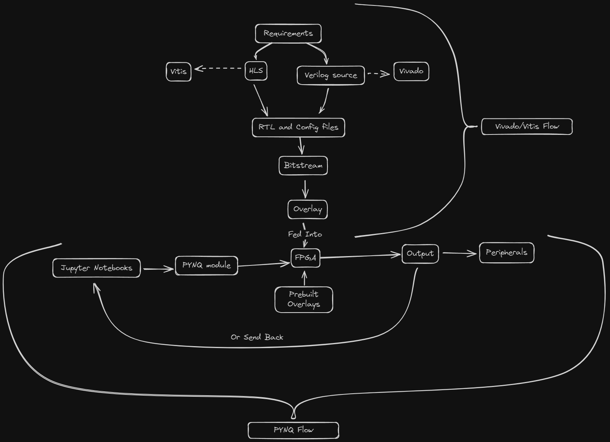

# Table of Content
1. [Introduction](#introduction)
2. [Tool Flows](#tool-flows)
	1. [Starting Vivado](#starting-ip-vivado)
	2. [Starting Vitis](#starting-up-vitis)
	3. [Programming with Vitis](#programming-with-vitis)
	4. [Programming with PYNQ](#programming-with-pynq)

# Introduction
<p>
LEGOs, the age old pastime of kids around the world and the age old torture device of people unlucky enough to step on them with bare feet.
</p>

<p>
So what can LEGOs teach us about digital electronics. A lot actually. FPGAs are nothing but a bunch of digital LEGO bricks waiting to be connected to each other. Except in FPGAs these bricks/components are called LUTs or Look Up Tables. </p>

<p>
These LUTs are programable cells that can be configured to perform a certain function like AND, OR etc. So essentially giving our bricks the superpower to change shape based on our requirements!
</p>

<p>
This level of programmability allows anyone with sufficient knowledge and patience to implement almost any digital circuit or system you can imagine. This allows for rapid prototyping and testing any circuit. Therefore an FPGA implementation is done before an ASIC (Application-specific integrated circuit) implementation. 
</p>

# Tool Flows
<p>
Now let's talk about how we assemble these LUTs. Unlike a the physical bricks of LEGO, which we can put together with our hands, we need to use specialized EDA (Electronic Design Automation) tools to do this for us. Enter Vivado.
</p>


### Starting up Vivado
1. To start Vivado type the following by replacing install_path and version
	```sh
	source <install_path>/Vivado/<version>/settings64.sh 
	vivado
	```
2. After Vivado starts up, you will see the Start Page. This screen provides several options:

	- **Create New Project**: Opens the New Project wizard to create a new project

	- **Open Project**: Opens a file browser to select an existing Xilinx Project (.xpr) file- **Open Example Project**: Guides you through creating a new project based on an example project

	- **Open Hardware Manager**: Opens the Hardware Manager without an associated project

3. To create a new project, click on "Create New Project" in the Quick Start panel. This will open the New Project dialog.
4. Follow the steps in the New Project wizard to specify the project name, location, project type (RTL Project), add sources if available, select the target board or device, and finish creating the project

### Starting up Vitis
1. To launch Vitis on your local machine, open a terminal and run the following commands:
	```sh
	source <install_path>/Vitis/2020.1/settings64.sh vitis
	```

	This will launch the Vitis IDE. Alternatively, if Vivado is already open, you can launch Vitis through the Tools → Launch Vitis toolbar option.
	
2. When Vitis launches, you will be prompted to select a workspace, which is the directory where your projects and files will be stored. Choose an empty folder or create a new one.

3. The Vitis IDE provides a graphical user interface to create new application projects, add hardware functions, build the design, and run software and hardware emulation.

4. Vitis also supports a command-line flow where the user manages the compilation of host code and kernels using makefiles.

5. Vitis provides access to free comprehensive training courses and Vitis accelerated libraries for domain-specific and common libraries that are open-source and performance-optimized.
### Programming with Vitis
1. **Vivado Board Flow**:
	- Vivado is used to generate a custom .xsa file that is ported into Vitis as a platform project
	- Developers can create a custom Vitis platform if they require a different set of physical PL I/O peripherals than those provided in AMD generated platforms.
	- Vivado provides board files that automate the configuration of SOM-based peripherals for Kria boards like the K26 and K24 SOMs.
	- The Vivado board files are available in the XHUB store or can be manually downloaded from the board store repo or kria-vitis-platforms repo.
    
2. **Vitis Platform Flow**:
    - Developers use Vivado to generate a custom .xsa file to be ported into Vitis as a platform project
	- Once the platform project is created in Vitis, a corresponding device tree overlay (.dtbo) is generated.
	- With the .xsa and .dtbo files, developers can follow the Vitis Accelerator flow to create the final bitstream (.bit.bin), xclbin, and .dtbo files.

### Programming with PYNQ
The recommended programming flows for PYNQ are:
1. Using Jupyter notebooks and Python code to load overlays and interact with the hardware
2. Using Vivado to generate the hardware platform and Vitis to build the application, following examples like [PYNQ-HelloWorld](https://github.com/Xilinx/PYNQ-HelloWorld)

::github(repo="Daedalus-op/summer-with-chips")
